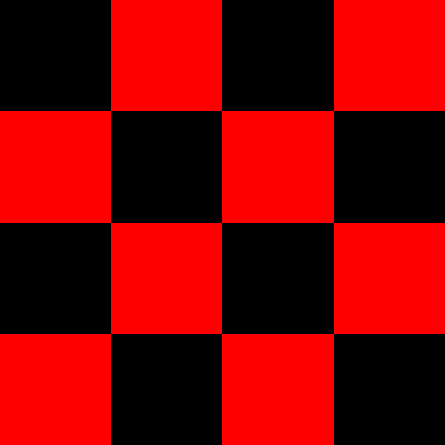
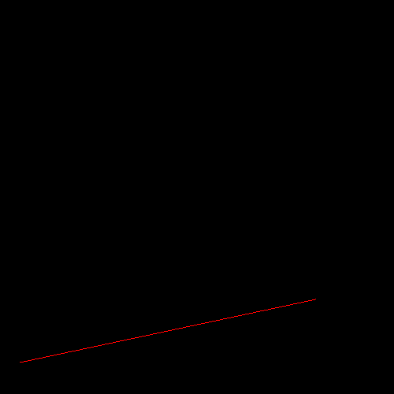
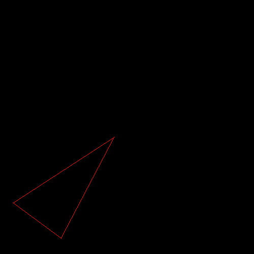
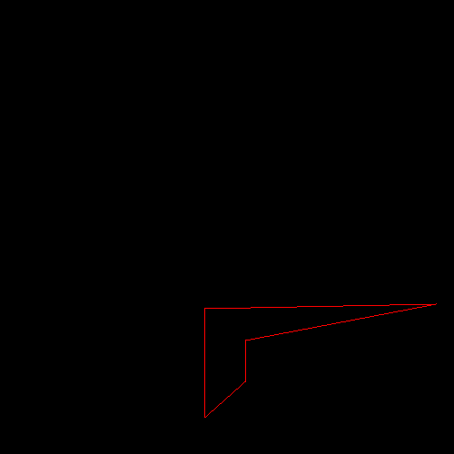
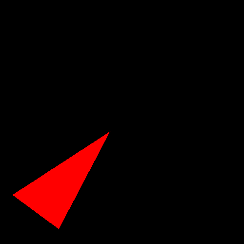

# Programming Assignment 1

Class: CS 4204 (Computer Graphics), Fall 2024

Professor: Brendan David-John

## Overview

In this programming assignment, you are going to complete the first step towards building our renderer: the screen module. As discussed in class, our renderer is going to be composed of several independent modules. The screen module is responsible displaying the result of a render. Specifically, it will provide a class called `Screen` that can take a 2D array of color values and display them on the computer's screen. This module allows us to implement and visualize and the output of the most basic rendering fundamentals, starting with line drawing between 2D points on the screen.

Please read the entire document before starting the assignment.

## Instructions

For this assignment, you will be provided a python file called `screen.py`, and within that file there will be a class called `Screen`. Getting a bunch of numbers to display on a computer monitor as colors can be a complicated task. For this class, we are going to make use of the PyGame project, which nicely provides a simple way to accomplish this. To use PyGame, you must first have the `pygame` package installed (see below). The template has provided an implementation of `Screen` with an initialization function, a function to compute the aspect ratio, a function to draw a buffer of RGB colors to the screen, and a function to show the result on a canvas. [This example](https://realpython.com/pygame-a-primer/#basic-pygame-program) and the documentation for the [`array_to_surface`](https://www.pygame.org/docs/ref/pixelcopy.html#pygame.pixelcopy.array_to_surface) method should provide you enough insight to understand the relevant PyGame functions being used.

Your first assignment is to implement the line drawing algorithm described in class within the `draw_line` function of `Screen`. The method takes as input two arrays of (x,y) points, a color value, and a image_buffer to write to. Once implemented, the test script `assignment1.py` will execute several visual tests to ensure your line drawing algorithm is working correctly. 

### Output

The following should be the output when `assignment1.py` is run:

```bash
python assignment1.py
```







### Dependency Management
Each assignment will include a requirements.txt file that includes the python package requirements for the assignment. If you are using PyCharm it should automatically detect and install the dependencies when you create the virtual environment. Otherwise, [these instructions](https://www.jetbrains.com/help/pycharm/managing-dependencies.html#configure-requirements) will help you manually manage the requirements in PyCharm. If you are using something other than PyCharm, you can use the command line to manually install the packages from the requirements.txt file:

```bash
pip install -r requirements.txt
```

## The Screen Class

### Exposed Members
There are no required exposed members. However, you should still create members to store information that will be needed for the correct operation of the class.

### Exposed Methods

#### `__init__(self, width, height)`
The constructor takes two integers as arguments: width and height. These two arguments define the size and shape of the resulting image.

#### `ratio(self)`
This method simply returns a float that is the ratio of the screen's width to height. That is, if the screen width is 100px and the screen height is 50px, then this method would return `2.0`.

#### `draw(self, buffer)`
This method takes a buffer of color values. The buffer should be a 3-dimensional numpy array with shape `(width, height, 3)`, where width and height are match those specified in the `__init__` call. The value `3` is because there are three values for each color (red, blue, and green). An exception should be thrown if the incoming buffer is of a different shape. The method simply transfers the values in the incoming buffer array to a pygame instance.

#### `draw_line(self, a, b, color, buffer)`
This method takes two arrays of 2D points (`a` and `b`) in pixel space. The method should set the appropriate pixels between the points within each row of `a` and `b` to the designated color within the provided image buffer. The arrays `a` and `b` are expected to be two-dimensional np arrays with two columns and N rows of points. Lines should be drawn for corresponding row of `a` to the point in the corresponding row of `b`.

#### `draw_polygon(self, a, b, color, buffer)`
This method takes two arrays of 2D points (`a` and `b`) in pixel space. The method should set the appropriate pixels to fill a closed polygon defined by the points within each row of `a` and `b` to the designated color within the provided image buffer. The arrays `a` and `b` are expected to be two-dimensional np arrays with two columns and N rows of points. 

#### `show(self)`
This method enters the main event loop and prevents the window from closing right away. The window should close when the pygame.QUIT event is triggered.

## Extra Credit
If you wish to receive the 1 extra credit point, you can implement a function `draw_polygon` within the `Screen` class. The function takes the exact same inputs as `draw_line` except that it will also fill in the pixels of the defined polygon. You can assume the input lines define a closed polygon. You can use any algorithm to fill the polygon. When run with python, `assignment1_extra_credit.py` should show a pygame window with a filled in triangle. This is something that you will need to implement in future assignments, so it would behoove you to figure it out now.



## Rubric
There are 10 points (11 with extra credit) for this assignment determined by running `assignment1.py` within your submitted code:
- *2 pts*: Checkerboard pattern is rendered as expected
- *8 pts*: Lines are rendered as expected
  + 2 pts line_1()
  + 2 pts line_2()
  + 2 pts lines_1()
  + 2 pts lines_2()
